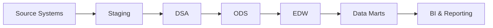

# 🏦 BFSI Legacy Data Warehouse Project

**Business Need → Trusted Analytics**

An end-to-end roadmap for building a data warehouse for a **Banking, Financial Services & Insurance (BFSI)** client, moving from legacy source systems to trusted, business-ready reporting. It covers the full lifecycle: discovery, data modelling, build, and consumption.

---

## 🗺️ Project Roadmap


**Overall flow:** `Client Need` → `Architecture` → `Data Model` → `Infrastructure` → `ETL Loads` → `Analytics`

---

## 🔄 Data Flow



---

## 📌 Phase 1: Discovery & Outcomes

| # | Step | Details | Persona |
|---|------|---------|---------|
| 01 | **Problem & Objectives** | Define business needs, KPIs and consumers | Business Team & Client |
| 02 | **Technical & Business Outcomes** | Translate needs into the DWH solution | BA, Data Solution Architect, Techno-Functional Manager, Data Modeler |

## 🧩 Phase 2: Data Modelling

| # | Step | Details | Persona |
|---|------|---------|---------|
| 03 | **Source-System Analysis** | Study files, formats, duplicates and quality | Data Modeler, Data Steward, Data Solution Architect |
| 04 | **Conceptual Model (High Level)** | Define Source, Staging, DSA, ODS, EDW, Marts and BI | Data Solution Architect, Data Modeler |
| 05 | **Conceptual Model (Low Level)** | Identify Branch, Customer, Account, Loan, Card, Payment and Transaction | Data Solution Architect, Data Modeler |
| 06 | **Logical Data Model** | Define entities, attributes, keys and cardinality | Data Solution Architect, Data Modeler |
| 07 | **Logical ER Diagram** | Visualize entity relationships | Data Solution Architect, Data Modeler |
| 08 | **Physical Data-Flow Diagram** | Design Source → Staging → DSA → ODS → EDW → Marts | Data Solution Architect, Data Modeler |

## 🛠️ Phase 3: Setup & Build

| # | Step | Details | Persona |
|---|------|---------|---------|
| 09 | **Physical DDL** | Create databases, tables, columns and data types | DWH Developer, Technical Lead, Admin Team |
| 10 | **Infrastructure Setup** | Prepare servers, tools, access and environments | Admin, Platform & Infrastructure Team |
| 11 | **Mapping Documents** | Define source, transformation and target rules | Technical Lead & Architect |
| 12 | **Staging Load** | Load raw source files into staging and DSA | Technical Lead, Architect & Developer |
| 13 | **DSA → ODS Load** | Clean, scrub, validate, standardize and audit | ETL / DWH Developer |
| 14 | **ODS → DWH Load** | Apply business rules; load dimensions, facts, aggregates and SCD | ETL / DWH Developer |
| 15 | **Final Fact & Data Mart Load** | Build subject-focused facts and KPI aggregates | ETL / DWH Developer |

## 📊 Phase 4: Consumption

| # | Step | Details | Persona |
|---|------|---------|---------|
| 16 | **Reports & Analytics** | Deliver dashboards, insights and decisions | BI Team, Executives, Managers, Auditors & Clients |

---

## 📖 Glossary

| Term | Meaning |
|------|---------|
| **DWH / EDW** | Data Warehouse / Enterprise Data Warehouse |
| **DSA** | Data Staging Area: a landing zone where raw data is held before cleansing |
| **ODS** | Operational Data Store: cleansed, integrated data close to the source structure |
| **Data Mart** | Subject-focused subset of the warehouse (for example loans or cards) for a specific business team |
| **SCD** | Slowly Changing Dimension: a technique to track changes in dimension data over time |
| **DDL** | Data Definition Language: SQL used to create databases, tables and columns |
| **ETL** | Extract, Transform, Load |
| **BFSI** | Banking, Financial Services and Insurance |

---

## 🗂️ Repository Structure

```
DataEngineering/
├── images/
│   └── Datawarehouse_Roadmap_Project_1.jpeg
└── README.md
```

---

## 👤 Author

**Peddisetty Narayana**: Data Engineer & Analyst
[LinkedIn](https://www.linkedin.com/in/peddisettynarayana/) · [GitHub](https://github.com/peddisettynarayana-03)
